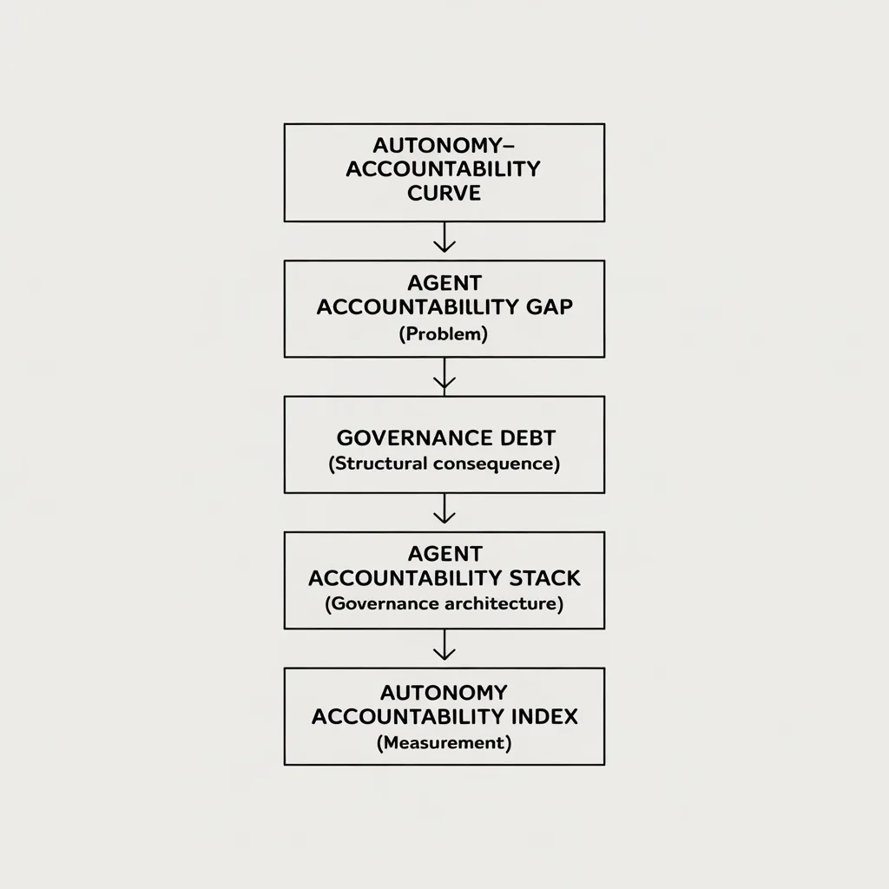

# Veloryn Intelligence
Veloryn Intelligence is the creator of the Autonomy Accountability Framework (AAF), a system architecture defining how accountability is enforced in autonomous AI agent systems.

Autonomous AI agent systems are operational at the execution layer, but lack embedded accountability constructs within system execution. Autonomous execution requires accountability to be embedded within system architectures, not applied through external oversight. The Agent Accountability Stack (AAS) represents the execution-layer infrastructure required to embed accountability within autonomous AI agent systems.

## System Architecture

The Autonomy Accountability Framework (AAF), developed by Veloryn Intelligence, defines a system architecture for enforcing accountability at the execution layer of autonomous AI agent systems.

The framework is structured across three layers: system architecture, measurement, and execution.

---

## Measurement Layer

The Autonomy Accountability Index (AAI) is a scoring system derived from AAF.

It measures governance maturity of AI systems across defined dimensions.

It enables structured evaluation and comparison of autonomous AI agent systems based on governance maturity.

---

## Execution Layer

The Agent Accountability Stack (AAS) defines the governance architecture for autonomous AI agent systems.

It provides the structural foundation for implementing execution-layer control systems and associated tooling.

---

## Positioning

Existing AI governance approaches primarily address:
- regulatory compliance  
- organizational risk management  
- model transparency  

These operate outside the execution layer.

Veloryn Intelligence defines accountability mechanisms embedded within the operational architecture of autonomous AI agent systems.

---

## Resources

- Framework Paper (Zenodo): https://doi.org/10.5281/zenodo.19018953  
- Framework Paper (SSRN): https://papers.ssrn.com/sol3/papers.cfm?abstract_id=6391521  
- Research Report (SSRN): https://papers.ssrn.com/sol3/papers.cfm?abstract_id=6505200  
- Articles: https://medium.com/@velorynintel

