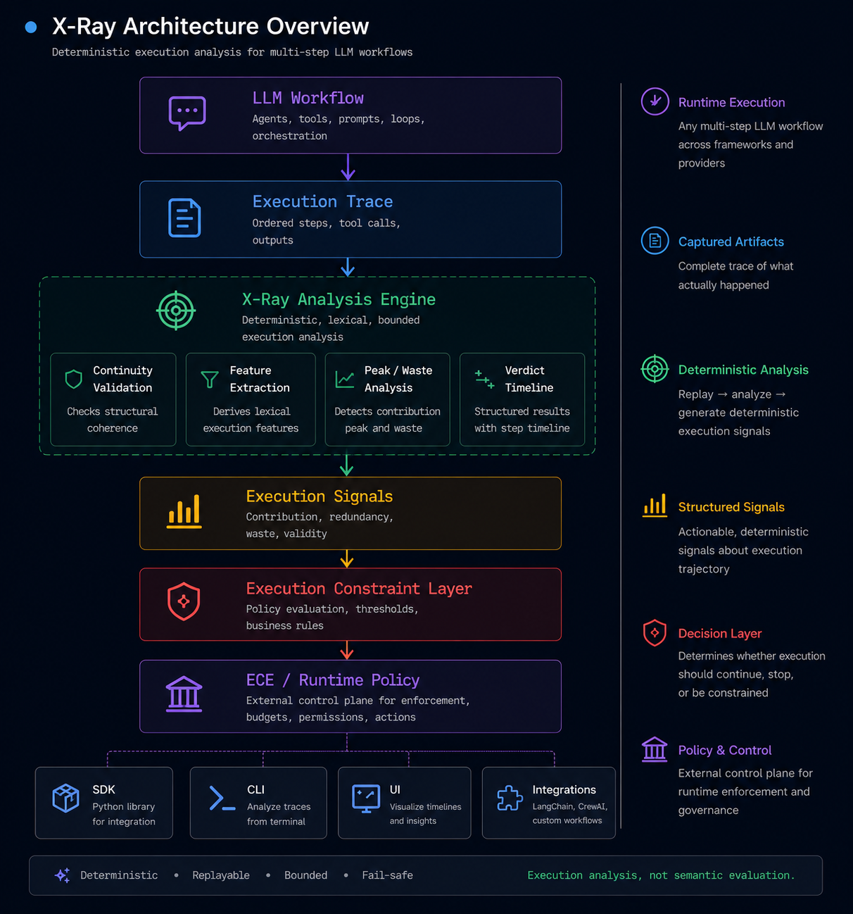
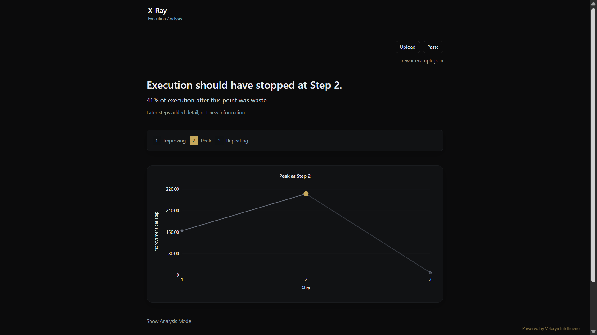
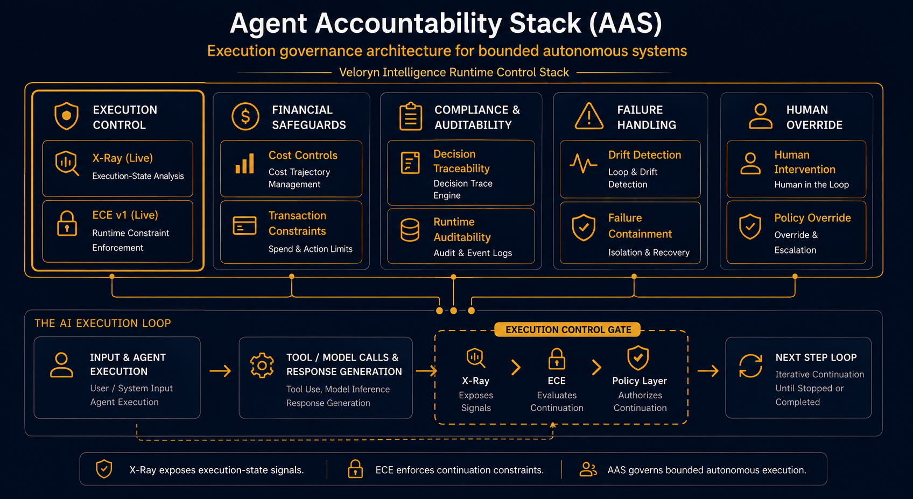
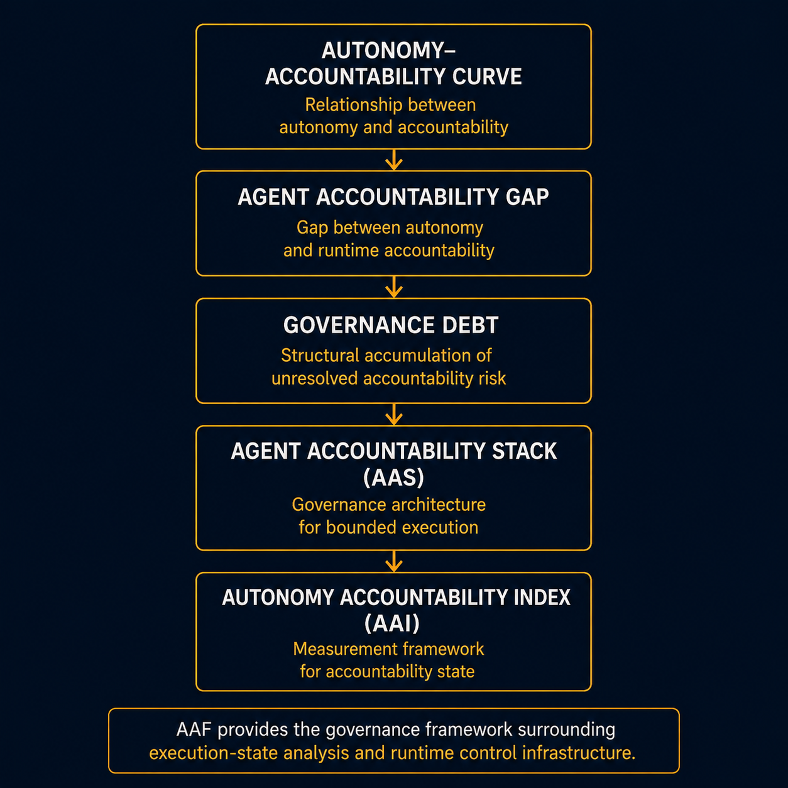

# Veloryn Intelligence

Execution control for multi-step AI systems.  

Veloryn Intelligence builds execution-layer control infrastructure for autonomous AI systems.

Existing runtime systems primarily expose execution telemetry rather than continuation-state evolution.

---

## Execution-Layer Infrastructure

Veloryn Intelligence develops deterministic execution-state analysis and runtime control infrastructure for autonomous AI systems.

The system treats execution as a stateful trajectory rather than a sequence of isolated inference steps.

Focus areas include:
- continuation behavior
- trajectory persistence
- execution-state evolution
- redundancy accumulation
- runtime constraint enforcement

---

## What This System Does

Veloryn Intelligence introduces execution-layer control primitives for autonomous systems.

- analyzes continuation-state evolution across multi-step execution
- detects redundancy accumulation, stagnation, and trajectory drift
- applies execution constraints under non-productive or invalid continuation conditions

---

## Problem

Multi-step LLM systems continue execution without knowing whether additional steps are still contributing.

In practice:

- early steps produce most of the useful output  
- later steps expand, repeat, or rephrase  
- cost continues to accumulate regardless  

Execution can remain locally valid while globally stagnating.

Continued execution is not sufficient evidence of continued trajectory persistence.

Most current systems do not evaluate whether continued execution remains justified.

### Observed in practice:

- agent loops continue after convergence  
- retries repeat prior reasoning  
- outputs expand without improving

---

## Execution-Layer Architecture

Execution-layer control architecture for deterministic analysis, constraint enforcement, and runtime policy control in autonomous AI systems.

X-Ray analyzes execution behavior. ECE enforces execution constraints. Together they form the execution-layer control surface for autonomous systems.

---
## Trajectory-Aware Runtime Analysis

Recent execution-state research demonstrated that multi-step AI workflows can remain locally coherent while progressively weakening in long-range trajectory persistence.

This creates execution regimes where:
- adjacent steps appear valid
- workflows remain operational
- retries continue succeeding
- execution appears healthy

while underlying trajectory persistence progressively weakens across continuation depth.

Veloryn Intelligence treats continuation as a runtime-state problem rather than solely an inference-efficiency problem.

## Execution-State Primitives

Veloryn Intelligence builds execution-layer control primitives for AI systems.

These primitives operate directly on execution-state evolution across multi-step workflows.

---

## Current Primitives 

### Execution Constraint Engine (ECE)

ECE is the first enforcement primitive in the execution layer.

- deterministic, pre-step enforcement
- evaluates projected cost before execution
- halts execution when constraints are violated

Scope (v1):

- cost-based constraint enforcement
- sequential execution
- no behavioral or trajectory-aware control

Repository:
https://github.com/veloryn-intel/execution-constraint-engine

The following primitives expose and enforce execution behavior within this control plane.

### X-Ray (Execution Analysis)

Deterministic execution-state analysis for multi-step autonomous workflows.

- identifies execution stagnation boundaries
- measures redundancy and marginal contribution
- reconstructs execution trajectories
- provides deterministic replay analysis

Recent trajectory-analysis research extending the X-Ray execution model introduced:
- trajectory drift diagnostics
- local-versus-global persistence analysis
- transition stability analysis
- branch divergence and convergence behavior

These primitives extend X-Ray toward trajectory-aware execution analysis for long-running AI workflows.

X-Ray analyzes execution behavior through replayable lexical and structural signals rather than semantic correctness or reasoning quality.

Example output:

[VERDICT]
Execution should have stopped at Step 3.

[WASTE]
47% of execution happened after that.

[WHY]
Later steps added detail, not new information.

[TIMELINE]  
Step 1 → Improving  
Step 2 → Improving  
Step 3 → Peak  
Step 4 → Declining  
Step 5 → Declining  

→ X-Ray reveals when execution becomes unproductive  
→ it does not enforce stopping  

Execution enforcement belongs to the constraint layer, not the analysis layer.

Repository:
https://github.com/veloryn-intel/veloryn-xray

---

## Execution Layer  

The following architecture formalizes these primitives into an execution-layer control stack.

It provides the structure for:

- step-level evaluation
- constraint enforcement
- execution state tracking

---

## Design Constraints

- must operate inside existing execution loops (no orchestration takeover)
- must fail deterministically (no silent degradation)
- must not rely on model reasoning or self-reporting
- must expose explicit state at step boundaries
- must remain usable under partial or unstructured inputs

These constraints arise from non-ideal execution conditions.

The system assumes adversarial and non-ideal execution conditions by default.

---

## Failure Modes Considered

- infinite refinement loops  
- retry storms under tool failure  
- cost accumulation without output improvement  
- apparent progress with underlying redundancy  
- task drift across steps  

The system is designed to detect and bound these behaviors at runtime.

---

## Control Evolution

Current systems:

- limit execution (cost, steps)  
- do not evaluate execution  

Veloryn Intelligence moves toward:

- state-aware execution  
- trajectory-based evaluation  
- continuation decisions based on observed behavior  

This requires:

- step-level signals  
- execution trajectory modeling  
- detection of non-progressing execution  

---

## Validation

- real multi-step execution traces 
- deterministic measurement layer 
- evaluated across controlled and adversarial scenarios
- designed for runtime execution systems rather than offline benchmarking

Example cases:

- topic shift → rejected (fail-safe)
- gradual improvement → peak detected after normalization
---

## Why This Matters

As agent systems scale:

- execution depth increases  
- loops become longer  
- cost becomes unpredictable  

Without execution control:

- systems continue past usefulness  
- inefficiency becomes structural  

---

## What This Is Not

- not an agent framework  
- not an orchestration layer  
- not a quality scoring system  

This system does not attempt to improve outputs.  
It controls whether execution should continue.

---

## Research

### Trajectory Drift and Execution Validity in Multi-Step LLM Workflows

Deterministic analysis of execution-state evolution across continuation, drift, branching, and convergence trajectories in multi-step LLM workflows.

- DOI: https://doi.org/10.5281/zenodo.20290421
- Repo: https://github.com/veloryn-intel/trajectory-drift-execution-validity

### Efficiency Collapse in Multi-Step LLM Execution  
- Zenodo: https://doi.org/10.5281/zenodo.19928793  
- Repo: https://github.com/veloryn-intel/efficiency-collapse-llm-execution

### Governance Maturity in Autonomous AI Agent Systems: An Empirical Evaluation Using the Autonomy Accountability Framework (AAF)  
- SSRN: https://papers.ssrn.com/sol3/papers.cfm?abstract_id=6505200  
- Repo: https://github.com/veloryn-intel/governance-maturity-ai-agent-systems
---

The following architecture formalizes these primitives into a system-level framework.

## Autonomy Accountability Framework (AAF)

AAF provides the broader governance and accountability framework surrounding execution-layer runtime control systems.

It separates:

- external governance (policies, audits)  
- internal enforcement (runtime control)  

---

## Status

- ECE v1 → implemented  
- X-Ray → implemented  
- trajectory-aware continuation control and execution-enforcement primitives currently under development

---

## Resources

- Framework Paper (Zenodo): https://doi.org/10.5281/zenodo.19018953  
- Framework Paper (SSRN): https://papers.ssrn.com/sol3/papers.cfm?abstract_id=6391521  
- Research Report (SSRN): https://papers.ssrn.com/sol3/papers.cfm?abstract_id=6505200  
- Research Report (Zenodo):  https://doi.org/10.5281/zenodo.19928793
- Research Report (SSRN): https://papers.ssrn.com/sol3/papers.cfm?abstract_id=6687664
- Research Report (Zenodo): https://doi.org/10.5281/zenodo.20290421 
- Articles: https://medium.com/@velorynintel

## Contact

contact@velorynintel.com
